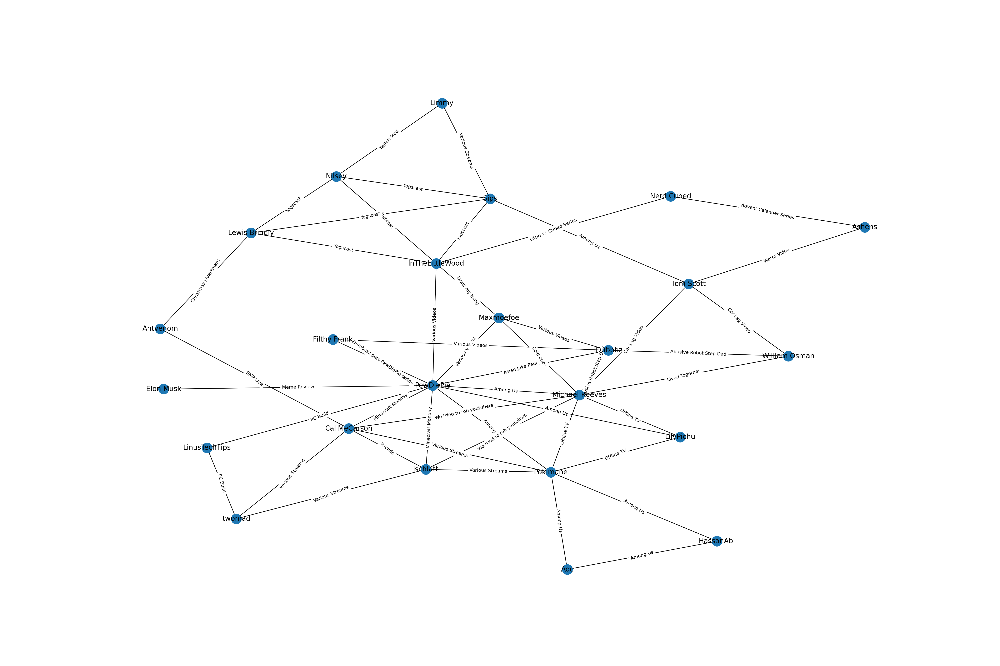

# Content Creator Interaction Graphing

This project aims not to produce a complete and comprehensive graph of the interaction between notable online content creators but just something I producded for fun when trying to find the degrees of seperation between [Limmy](https://www.twitch.tv/limmy) and [Pokimane](https://www.twitch.tv/pokimane).

## [main.py](main.py)

This is the main script of the project, run this to produce the graph stored in Graph.png from [interactions.csv](interactionscsv).

## [interactions.csv](interactions.csv)

This is where the list of interactions between creators are stored in the following format.
The order in which creators are listed doesn't matter and neither does the amount of times they are listed (As far as I can tell from my limited testing).

| Creator 1 | Creator 2      | Interaction   |
| --------- | -------------- | ------------- |
| Tom Scott | Sips           | Among Us      |
| Tom Scott | Michael Reeves | Car lag video |

## Graph.png

Here is where the graph produced after running [main.py](main.py) is stored.
<<<<<<< HEAD

=======
>>>>>>> 2ce0e0adf5d0d45ee5829cd8f82618d1760512c9
